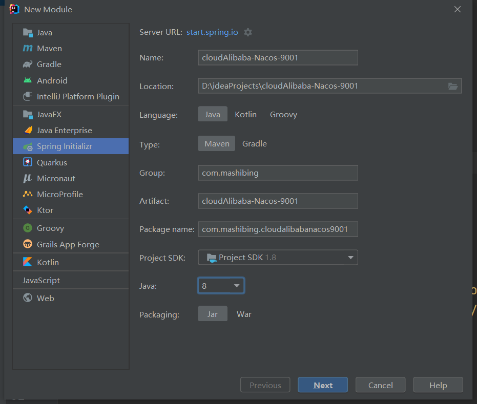
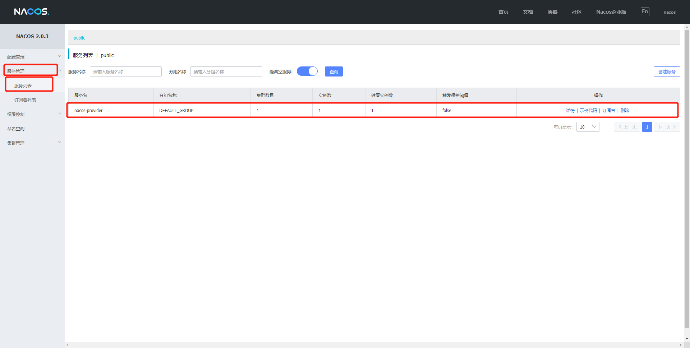

# Nacos服务提供者注册

## Nacos代替Eureka

​	Nacos可以直接提供注册中心（Eureka）+配置中心（Config），所以它的好处显而易见，我们在上节课成功安装和启动了Nacos以后就可以发现Nacos本身就是一个小平台，它要比之前的Eureka更加方便，不需要我们在自己做配置。


## Nacos服务注册中心

​	服务发现是微服务架构中的关键组件之一。在这样的架构中，手动为每个客户端配置服务列表可能是一项艰巨的任务，并且使得动态扩展极其困难。Nacos Discovery 帮助您自动将您的服务注册到 Nacos 服务器，Nacos 服务器会跟踪服务并动态刷新服务列表。此外，Nacos Discovery 将服务实例的一些元数据，如主机、端口、健康检查 URL、主页等注册到 Nacos。

​	学习任何知识我们都需要从它的官方文档入手，所以我们直接来看官网给我们提供的文档：https://spring.io/projects/spring-cloud-alibaba#learn


​	

## 如何引入Nacos Discovery进行服务注册/发现

### 创建新项目

聚合项目：由于聚合带来的诸多好处，在SpringBoot项目开发中也广泛采用，开发中将SpringBoot项目按照功能分成子模块开发，所以我们在使用Spring Cloud Alibaba完成项目的时候，也是采用聚合项目来完成。

​	父项目	


​	子项目



### POM

​	对应依赖版本关系可以参考官网：https://github.com/alibaba/spring-cloud-alibaba/wiki/%E7%89%88%E6%9C%AC%E8%AF%B4%E6%98%8E

​	父项目pom文件

```java
<?xml version="1.0" encoding="UTF-8"?>
<project xmlns="http://maven.apache.org/POM/4.0.0" xmlns:xsi="http://www.w3.org/2001/XMLSchema-instance"
         xsi:schemaLocation="http://maven.apache.org/POM/4.0.0 https://maven.apache.org/xsd/maven-4.0.0.xsd">
    <modelVersion>4.0.0</modelVersion>
    <parent>
        <groupId>org.springframework.boot</groupId>
        <artifactId>spring-boot-starter-parent</artifactId>
        <version>2.2.13.RELEASE</version>
        <relativePath/> <!-- lookup parent from repository -->
    </parent>
    <groupId>com.mashibing</groupId>
    <artifactId>SpringCloudAlibabaMSB</artifactId>
    <version>0.0.1-SNAPSHOT</version>
    <name>SpringCloudAlibabaMSB</name>
    <packaging>pom</packaging>
    <description>SpringCloudAlibabaMSB</description>
    <properties>
        <java.version>1.8</java.version>
        <spring-cloud-alibaba-version>2.2.5.RELEASE</spring-cloud-alibaba-version>
    </properties>
    <dependencies>
        <dependency>
            <groupId>org.springframework.boot</groupId>
            <artifactId>spring-boot-starter-web</artifactId>
        </dependency>
        <dependency>
            <groupId>org.springframework.boot</groupId>
            <artifactId>spring-boot-starter-tomcat</artifactId>
            <scope>provided</scope>
        </dependency>
        <dependency>
            <groupId>org.springframework.boot</groupId>
            <artifactId>spring-boot-starter-test</artifactId>
            <scope>test</scope>
        </dependency>
    </dependencies>
    <dependencyManagement>
        <dependencies>
            <dependency>
                <groupId>com.alibaba.cloud</groupId>
                <artifactId>spring-cloud-alibaba-dependencies</artifactId>
                <version>${spring-cloud-alibaba-version}</version>
                <type>pom</type>
                <scope>import</scope>
            </dependency>
        </dependencies>
    </dependencyManagement>

    <modules>
        <module>cloudAlibaba-Nacos-9001</module>
    </modules>

</project>
```

​	子项目pom文件

```java
<?xml version="1.0" encoding="UTF-8"?>
<project xmlns="http://maven.apache.org/POM/4.0.0" xmlns:xsi="http://www.w3.org/2001/XMLSchema-instance"
         xsi:schemaLocation="http://maven.apache.org/POM/4.0.0 https://maven.apache.org/xsd/maven-4.0.0.xsd">
    <modelVersion>4.0.0</modelVersion>
    <parent>
        <groupId>com.mashibing</groupId>
        <artifactId>SpringAlibabaMSB</artifactId>
        <version>0.0.1-SNAPSHOT</version>
        <relativePath/> <!-- lookup parent from repository -->
    </parent>
    <groupId>com.mashibing</groupId>
    <artifactId>cloudalibaba-nacos-9001</artifactId>
    <version>0.0.1-SNAPSHOT</version>
    <name>cloudalibaba-nacos-9001</name>
    <description>cloudalibaba-nacos-9001</description>

    <dependencies>
        <dependency>
            <groupId>org.springframework.boot</groupId>
            <artifactId>spring-boot-starter-web</artifactId>
        </dependency>
        <dependency>
            <groupId>com.alibaba.cloud</groupId>
            <artifactId>spring-cloud-starter-alibaba-nacos-discovery</artifactId>
        </dependency>
    </dependencies>
</project>
```


### YML


```java
server:
  port: 9001
spring:
  application:
    name: nacos-provider
  cloud:
    discovery:
      server-addr: 127.0.0.1:8848

management:
  endpoint:
    web:
      exposure:
        include:'*'
```

### 启动类

```java
package com.mashibing.cloudalibabanacos9001;

import org.springframework.boot.SpringApplication;
import org.springframework.boot.autoconfigure.SpringBootApplication;
import org.springframework.cloud.client.discovery.EnableDiscoveryClient;

@SpringBootApplication
@EnableDiscoveryClient//加此注解
public class CloudalibabaNacos9001Application {

    public static void main(String[] args) {
        SpringApplication.run(CloudalibabaNacos9001Application.class, args);
    }

}

```


### 业务类

```java
package com.mashibing.cloudalibabanacos9001.controller;

import org.springframework.beans.factory.annotation.Value;
import org.springframework.web.bind.annotation.GetMapping;
import org.springframework.web.bind.annotation.PathVariable;
import org.springframework.web.bind.annotation.RestController;

@RestController
public class DemoController {

    @Value("${server.port}")
    private String serverPort;

    @GetMapping(value = "/mashibing")
    public String getServerPort(){
        return "Hello Nacos Discovery"+serverPort;
    }

}
```


### 测试

**注意，在启动项目前一定要启动Nacos**




## 练习

​	根据上面的练习演示，在创建一个新的9002端口作为服务注册到Nacos中，为了下节课来做准备

