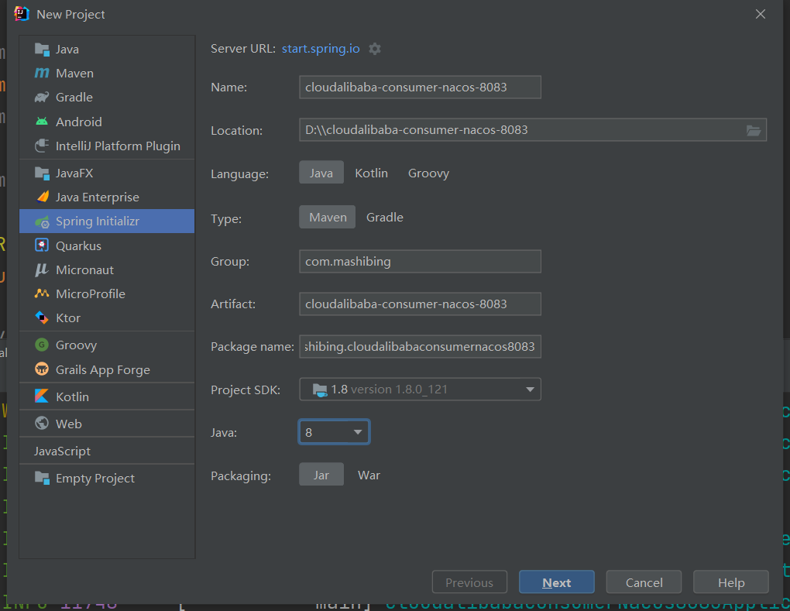
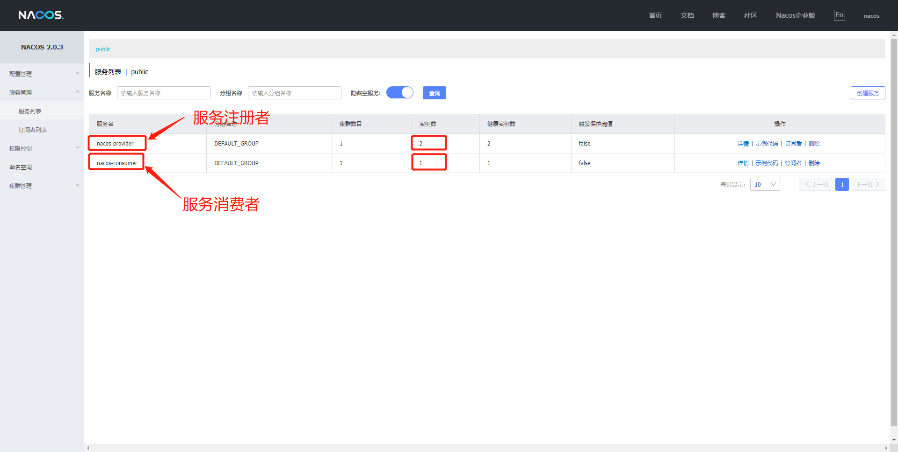
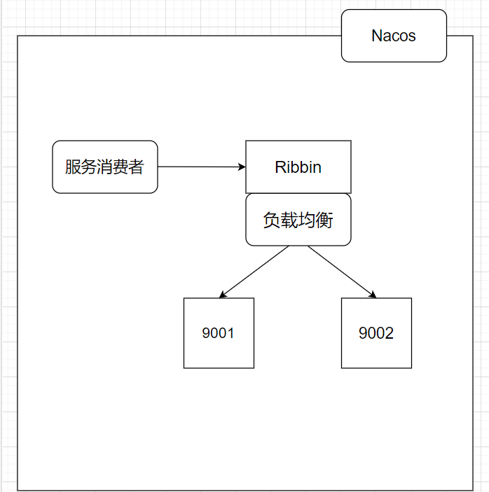

# Nacos服务消费者注册和负载均衡


## 服务消费者

​	上节课我们成功配置了Nacos服务提供者的注册，那么这节课我们将配置服务消费者，同时来验证Nacos自带负载均衡。


## 具体配置

### 新建Module



#### pom

```java
<?xml version="1.0" encoding="UTF-8"?>
<project xmlns="http://maven.apache.org/POM/4.0.0" xmlns:xsi="http://www.w3.org/2001/XMLSchema-instance"
         xsi:schemaLocation="http://maven.apache.org/POM/4.0.0 https://maven.apache.org/xsd/maven-4.0.0.xsd">
    <modelVersion>4.0.0</modelVersion>
    <parent>
        <groupId>com.mashibing</groupId>
        <artifactId>SpringAlibabaMSB</artifactId>
        <version>0.0.1-SNAPSHOT</version>
        <relativePath/> <!-- lookup parent from repository -->
    </parent>
    <groupId>com.mashibing</groupId>
    <artifactId>cloudalibaba-consumer-nacos-8083</artifactId>
    <version>0.0.1-SNAPSHOT</version>
    <name>cloudalibaba-consumer-nacos-8083</name>
    <description>cloudalibaba-consumer-nacos-8083</description>
    <properties>
        <java.version>1.8</java.version>
    </properties>
    <dependencies>
        <dependency>
            <groupId>org.springframework.boot</groupId>
            <artifactId>spring-boot-starter-web</artifactId>
        </dependency>
        <dependency>
            <groupId>com.alibaba.cloud</groupId>
            <artifactId>spring-cloud-starter-alibaba-nacos-discovery</artifactId>
        </dependency>
    </dependencies>
</project>
```

注意父项目要添加<models>标记

```java
<modules>
    <module>cloudalibaba-nacos-9001</module>
    <module>cloudalibaba-nacos-9002</module>
    <module>cloudalibaba-consumer-nacos-8083</module>
</modules>
```


#### yml

```java
server:
  port: 8083
spring:
  application:
    name: nacos-consumer
  cloud:
    discovery:
      server-addr: localhost:8848

```


#### 主启动

```java
package com.mashibing.cloudalibabaconsumernacos8083;

import org.springframework.boot.SpringApplication;
import org.springframework.boot.autoconfigure.SpringBootApplication;
import org.springframework.cloud.client.discovery.EnableDiscoveryClient;

@SpringBootApplication
@EnableDiscoveryClient
public class CloudalibabaConsumerNacos8083Application {

    public static void main(String[] args) {
        SpringApplication.run(CloudalibabaConsumerNacos8083Application.class, args);
    }

}
```

#### 测试

注意：要先启动Nacos，然后再来启动服务




## 远程调用与Ribbon

​	大家现在肯定很疑惑，这个服务消费者不是要调用具体服务吗？但是现在仅仅是创建出来了，和上节课创建的服务者也没有多大的区别啊？这具体怎么用那？

是这样的，我们现在想要让这个服务的消费者去调用服务提供者，我们就需要通过Ribbon来进行调用，那么首先我们先来了解Ribbon。


#### 什么是Ribbon

​	它是一个基于HTTP和TCP**客户端**负载均衡器。它虽然只是一个工具类库，它却是**每一个微服务**的基础设施。因为实际上，对于服务间调用、API网关请求转发都需要经过Ribbon负载均衡来实现。总体来说，Ribbon的主要作用是：从注册服务器端拿到对应服务列表后以负载均衡的方式访问对应服务。

​	要注意的是Nacos已经整合了Ribbon，所以我们想要使用只需要导入Spring Cloud Alibaba Nacos的依赖就可以直接使用了。




​	

#### 具体使用

现在如果我们需要远程访问那么可以使用RestTemplate，其中getForObject是最常用方法，同时还要在服务消费者中配置RestTemplate：

```java
@Bean
@LoadBalanced
public RestTemplate restTemplate(){
    return new RestTemplate();
}

restTemplate.getForObject(arg1,arg2,arg3...);
```

**第一个参数url表示被调用的目标Rest接口位置**

		1. url的第一部分是在Nacos中注册的服务提供者名称，如果多个服务提供者注册相同名称，Ribbon会自动寻找其中一个服务提供者，并且调用接口方法。这个就是负载均衡功能。
		2. url后半部是控制器的请求路径。

**第二个参数是返回值类型**

1. JavaBean类型或者JavaBean数组类型，如果控制器返回的是List集合，需要使用数组类型接收。

**第三个参数是可变参数**

1. 是传递给url的动态参数，使用参数时候需要在url上需要使用{1}、{2}、{3}进行参数占位，这样传递的参数就会自动替换占位符。


## 验证Nacos自带负载均衡

​	我们现在知道了如果我们想要让服务消费者consumer-nacos-8083调用服务提供者nacos-9001或者9002，那么必然要使用扶负载均衡Ribbon和远程调用RestTemplate，所以我们要做的第一件事情就是先让9001或者9002服务对外提供接口，用于访问，由于9001已经有对外提供的接口了，所以我们只需要仿照完成9002即可

```java
package com.mashibing.cloudalibabanacos9002.controller;

import org.springframework.beans.factory.annotation.Value;
import org.springframework.web.bind.annotation.GetMapping;
import org.springframework.web.bind.annotation.RestController;

@RestController
public class DemoController {

    @Value("${server.port}")
    private String serverPort;

    @GetMapping(value = "/mashibing")
    public String getServerPort(){
        return "Hello Nacos Discovery"+serverPort;
    }

}
```

​	接下来我们就需要通过服务消费8083者来访问9001或者9002，但是在这之前，我们先在consumer-nacos-8083模块中的yml文件里添加一句话

```java
server:
  port: 8083
spring:
  application:
    name: nacos-consumer
  cloud:
    discovery:
      server-addr: localhost:8848

# 消费者将要去访问的微服务名称（注册成功的Nacos的微服务提供者）
service-url:
  nacos-user-service: http://nacos-provider
```

​	因为我们要远程调用，所以我们还需要在启动类上配置restTemplate

```java
package com.mashibing.cloudalibabaconsumernacos8083;

import org.springframework.boot.SpringApplication;
import org.springframework.boot.autoconfigure.SpringBootApplication;
import org.springframework.cloud.client.discovery.EnableDiscoveryClient;
import org.springframework.cloud.client.loadbalancer.LoadBalanced;
import org.springframework.context.annotation.Bean;
import org.springframework.web.client.RestTemplate;

@SpringBootApplication
@EnableDiscoveryClient
public class CloudalibabaConsumerNacos8083Application {

    public static void main(String[] args) {
        SpringApplication.run(CloudalibabaConsumerNacos8083Application.class, args);
    }

    @Bean
    @LoadBalanced
    public RestTemplate restTemplate(){
        return new RestTemplate();
    }

}
```

​	配置好之后，我们就可以在8083的消费者上来通过Ribbon来自动的负载均衡调用9001或者9002的服务提供者了

```java
package com.mashibing.cloudalibabaconsumernacos8083.controller;

import org.springframework.beans.factory.annotation.Value;
import org.springframework.web.bind.annotation.GetMapping;
import org.springframework.web.bind.annotation.PathVariable;
import org.springframework.web.bind.annotation.RestController;
import org.springframework.web.client.RestTemplate;

import javax.annotation.Resource;

@RestController
public class DemoController {

    @Resource
    private RestTemplate restTemplate;

    /**
     * 消费者去访问具体服务，这种写法可以实现
     * 配置文件和代码的分离
     */
    @Value("${service-url.nacos-user-service}")
    private String serverURL;


    @GetMapping(value = "consumer/nacos")
    public String getDiscovery(){
        System.err.println(serverURL);
        return restTemplate.getForObject(serverURL+"/mashibing",String.class);
    }
}
```

测试结果：

```java
访问：http://localhost:8083/consumer/nacos

结果：Hello Nacos Discovery9001/9002(负载均衡切换显示)
```


总结：因为Nacos中本身就集成了Ribbon所以它本身就自带负载均衡


