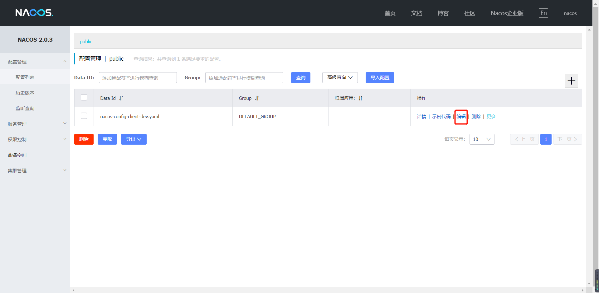

# Nacos之服务配置中心


##  基础配置

Nacos不仅仅可以作为注册中心来使用，同时它支持作为配置中心


首先我们还是新建Model：cloudalibaba-config-3377

### pom文件

​	这里我们主要要引入的是此依赖，这个依赖依据在官网上可以找到:https://spring-cloud-alibaba-group.github.io/github-pages/greenwich/spring-cloud-alibaba.html#_an_example_of_using_nacos_discovery_for_service_registrationdiscovery_and_call

```java
<dependency> 
    <groupId> com.alibaba.cloud </groupId> 
    <artifactId> spring-cloud-starter-alibaba-nacos-config </artifactId> 
</dependency>
```


### YML配置

​	要注意的是这里我们要配置两个，因为Nacos同SpringCloud-config一样，在项目初始化时，要保证先从配置中心进行配置拉取，拉取配置之后，才能保证项目的正常启动。

​	springboot中配置文件的加载是存在优先级顺序的，bootstrap优先级高于application

​	分别要配置的是，这里bootstrap.yml配置好了以后，作用是两个，第一个让3377这个服务注册到Nacos中，第二个作用就是去Nacos中去读取指定后缀为yaml的配置文件：

bootstrap.yml

```java
# nacos配置
server:
  port: 3377

spring:
  application:
    name: nacos-config-client
  cloud:
    nacos:
      discovery:
        server-addr: localhost:8848 #Nacos服务注册中心地址
      config:
        server-addr: localhost:8848 #Nacos作为配置中心地址
        file-extension: yaml #指定yaml格式的配置
```

application.yml

```java
spring:
  profiles:
    active: dev # 表示开发环境
```


### 主启动

```java
package com.mashibing.cloudalibabaconfig3377;

import org.springframework.boot.SpringApplication;
import org.springframework.boot.autoconfigure.SpringBootApplication;
import org.springframework.cloud.client.discovery.EnableDiscoveryClient;

@SpringBootApplication
@EnableDiscoveryClient
public class CloudalibabaConfig3377Application {

    public static void main(String[] args) {
        SpringApplication.run(CloudalibabaConfig3377Application.class, args);
    }

}
```


### 业务类

​	这里的@RefreshScope实现配置自动更新，意思为如果想要使配置文件中的配置修改后不用重启项目即生效，可以使用@RefreshScope配置来实现

```java
package com.mashibing.cloudalibabaconfig3377.controller;

import org.springframework.beans.factory.annotation.Value;
import org.springframework.cloud.context.config.annotation.RefreshScope;
import org.springframework.web.bind.annotation.RestController;

@RestController
@RefreshScope //支持Nacos的动态刷新功能
public class ConfigClientController {

    @Value("${config.info}")
    private String configInfo;

    @GetMapping("/config/info")
    public String getConfigInfo(){
        return configInfo;
    }

}
```

### Nacos配置规则

​	在 Nacos Spring Cloud 中，`dataId` 的完整格式如下（详情可以参考官网 https://nacos.io/zh-cn/docs/quick-start-spring-cloud.html）：

```java
${prefix}-${spring.profiles.active}.${file-extension}
```

	1. `prefix` 默认为 `spring.application.name` 的值，也可以通过配置项 `spring.cloud.nacos.config.prefix`来配置。
	2. `spring.profiles.active` 即为当前环境对应的 profile，注意：**当 `spring.profiles.active` 为空时，对应的连接符 `-` 也将不存在，dataId 的拼接格式变成 `${prefix}.${file-extension}`**（不能删除）
	3. `file-exetension` 为配置内容的数据格式，可以通过配置项 `spring.cloud.nacos.config.file-extension` 来配置。目前只支持 `properties` 和 `yaml` 类型。
	4. 通过 Spring Cloud 原生注解 `@RefreshScope` 实现配置自动更新：
	5. 所以根据官方给出的规则我们最终需要在Nacos配置中心添加的配置文件的名字规则和名字为：

```java
# ${spring.application.name}-${spring.profiles.active}.${file-extension}
# nacos-config-client-dev.yaml
# 微服务名称-当前环境-文件格式
```


## Nacos平台创建配置操作

增加配置


```java
config: 
    info: nacos config center,version = 1
```

然后在配置中心就会看到刚刚发布的配置


## 自动配置更新

修改Nacos配置，不需要重启项目即可自动刷新



修改版本号为2，点击发布


## 测试

 启动服务访问服务来测试（没有修改之前是1，修改之后不需要重启项目既可以直接获取最新配置）：http://localhost:3377/config/info


