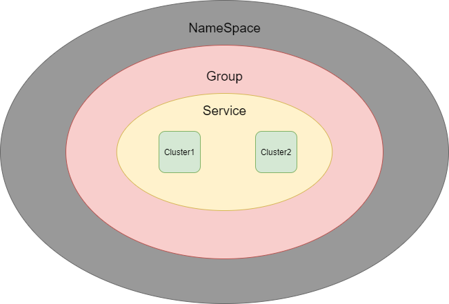
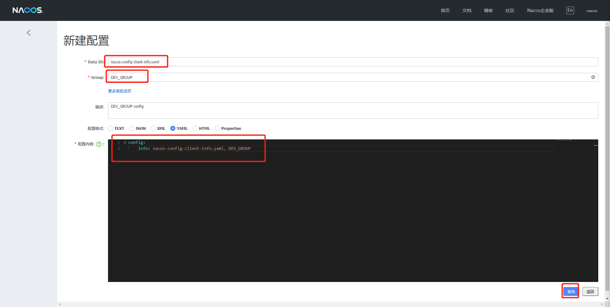
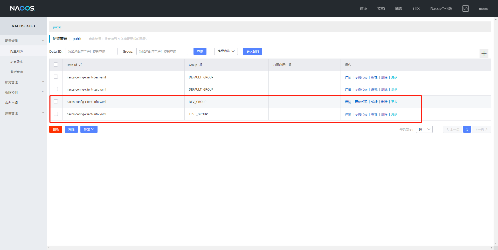
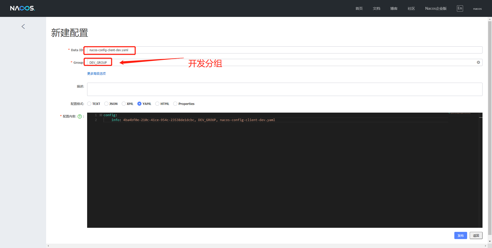

# Nacos命名空间分组和DataID三者关系

## 名词解释

**命名空间**（Namespace）

​	用于进行租户粒度的配置隔离。不同的命名空间下，可以存在相同的 Group 或 Data ID 的配置。Namespace 的常用场景之一是不同环境的配置的区分隔离，例如开发测试环境和生产环境的资源（如配置、服务）隔离等。

**配置分组**（Group）

​	Nacos 中的一组配置集，是组织配置的维度之一。通过一个有意义的字符串（如 Buy 或 Trade ）对配置集进行分组，从而区分 Data ID 相同的配置集。当您在 Nacos 上创建一个配置时，如果未填写配置分组的名称，则配置分组的名称默认采用 DEFAULT_GROUP 。配置分组的常见场景：不同的应用或组件使用了相同的配置类型，如 database_url 配置和 MQ_topic 配置。

**配置集 ID**（Data ID）

​	Nacos 中的某个配置集的 ID。配置集 ID 是组织划分配置的维度之一。Data ID 通常用于组织划分系统的配置集。一个系统或者应用可以包含多个配置集，每个配置集都可以被一个有意义的名称标识。Data ID 通常采用类 Java 包（如 com.taobao.tc.refund.log.level）的命名规则保证全局唯一性。此命名规则非强制。

​	配置集：一组相关或者不相关的配置项的集合称为配置集。在系统中，一个配置文件通常就是一个配置集，包含了系统各个方面的配置。例如，一个配置集可能包含了数据源、线程池、日志级别等配置项。


### 三者关系

​	这三者的关系类似于Java里面的package名和类名，最外层的Namespace是可以用于区分部署环境的，Group和DataID逻辑上区分两个目标对象。




**默认情况**

Namespace=public，Group=DEFAULT_GROUP，默认Cluster是DEFAULT


**具体情况**

​	Nacos默认的命名空间是public，我们就可以利用Namespace来实现隔离，比如我们现在有三个环境：开发、测试、生产环境，我们就可以创建三个Namespace，不同的Namespace之间是隔离的。

​	Group本身就是分组的意思，它可以把不同的微服务划分到同一个分组里面去。

​	剩下的就是具体微服务，一个Service可以包含多个Cluster，Nacos默认Cluster是DEFAULT，Cluster是对指定微服务的一个虚拟划分。比如说，将一个Service部署在北京和和杭州的机房中，北京机房的Service就可以起名为（BJ），杭州机房中的Service就可以起名为（HZ），这样就可以尽量让同一个机房的微服务互相调用，提升性能。


## 切换不同环境

### DataID方案

1. 指定spring.profile.active和配置文件的DataID来使不同环境下读取不同的配置，配置规则：默认空间+新建dev和test两个DataId：

   1. 新建dev配置DataID（已经创建完成）
   2. 新建test配置DataID

   

2. 通过spring.profile.active属性就能进行多环境下配置文件的读取

   

   

   ```java
   spring:
     profiles:
       # active: dev #表示开发环境
       active: test #表示测试环境
   ```

   

3. 测试

   最后再次访问：http://localhost:3377/localhost/config/info

   

   

### Group方案

​	根据之前的讲解我们都知道Group为分组默认是：DEFAULT_GROUP，所以现在我们就需要分出两组，一组是“Dev开发组”，一组是“test测试组”

 1. 新建Group

    DEV_GROUP



​		TEST_GROUP


配置列表，两个DataID一致，但是分组不同的配置文件：



2. 完成以上配置以后，接下来就需要通过bootstrap+application来配合完成，具体方式：在config下增加一条Group的配置即可，可以配置为DEV_GROUP或TEST_GROUP

​	bootstrap:

```java
# nacos配置
server:
  port: 3377

spring:
  application:
    name: nacos-config-client
  cloud:
    nacos:
      discovery:
        server-addr: localhost:8848 #Nacos服务注册中心地址
      config:
        server-addr: localhost:8848 #Nacos作为配置中心地址
        file-extension: yaml #指定yaml格式的配置
        group: TEST_GROUP #增加分组

```

​	application:

```java
spring:
  profiles:
    # active: dev #表示开发环境	
    # active: test #表示测试环境
    active: info
```


3. 测试（可以测试不同分组）：

   最后再次访问：http://localhost:3377/localhost/config/info


### Namespace空间方案

​	我们已经把DataID方案和Group方案完成了，然后接下来我们来看一下Namespace（命名空间）方案，默认此方案为public，此方案不能删除，我们现在来新建两个命名空间方案


1. 新建dev/test的Namespace


1. 服务管理-服务列表页面查看

   此时我们就可以切换对应的命名空间，然后再通过Group和DataID来进行切换，如果想要切换命名空间，我们就需要通过命名空间ID来进行切换

   

2. 按照域名配置（Namespace+Group+DataId）编写

   ​	先通过namespace命名空间ID来确认使用的命名空间

   

   ```java
   # nacos配置
   server:
     port: 3377
   
   spring:
     application:
       name: nacos-config-client
     cloud:
       nacos:
         discovery:
           server-addr: localhost:8848 #Nacos服务注册中心地址
         config:
           server-addr: localhost:8848 #Nacos作为配置中心地址
           file-extension: yaml #指定yaml格式的配置
           group: TEST_GROUP # 指定分组
           namespace: 4ba4bf0e-210c-41ce-954c-23538de1dcbc #指定命名空间
   ```

   ```java
   spring:
     profiles:
       active: dev #表示开发环境
       # active: test #表示测试环境
       # active: info
   ```

   ​	

   然后再回到Nacos配置列表，添加Dev命名空间下的配置，添加3条

   

   

   

3. 测试：访问http://localhost:3377/localhost/config/info来进行测试

