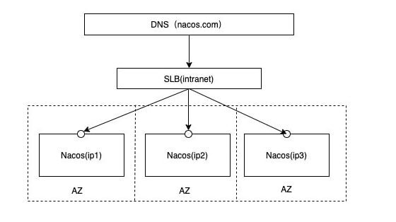

# Nacos集群架构说明

​	到目前为止，我们已经对Nacos的一些基本使用和配置已经掌握，但是这些还不够，我们还需要了解一个非常重要的点，就是Nacos的集群相关的操作，那我们就先从Nacos集群配置的概念说起

## Nacos支持三种部署模式

1. 单机模式 - 用于测试和单机试用
2. 集群模式 - 用于生产环境，确保高可用
3. 多集群模式 - 用于多数据中心场景

## 集群部署说明

参考网站：https://nacos.io/zh-cn/docs/cluster-mode-quick-start.html

**架构图**：部署生产使用的集群模式

**具体拆分**

## 预备环境

​	默认Nacos使用嵌入式数据库实现数据的存储，所以，如果启动多个默认配置下的Nacos节点，数据储存存在一致性问题，为了解决这个问题，Nacos采用了集中存储方式来支持集群化部署，目前仅支持MySql的存储。

1. 推荐使用Linux
2. 可以使用内部数据源或者外部数据源（推荐使用外部）MySql

