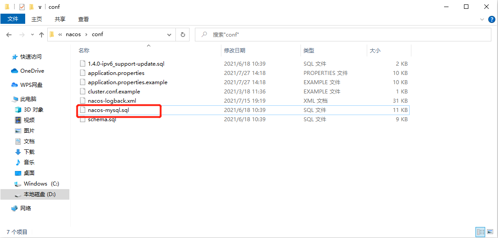

# Nacos持久化切换配置


## Nacos持久化配置

​	Nacos默认自带嵌入式数据库derby，所以我们每次创建一个Nacos实例就会有一个derby，当有多个Nacos节点的时候，就会出现一致性问题，所以Nacos支持了外部数据库统一数据管理MySql。


## Nacos默认derby切换MySql

具体配置方式可以参考官网：https://nacos.io/zh-cn/docs/deployment.html

1. 我们需要找到Nacos安装目录下的conf目录中的Sql脚本，然后在数据库中进行执行

   注意：需要我们先创建好数据库并且使用：

   ```java
   CREATE DATABASE nacos_config;
   USE nacos_config;
   ```



2. 修改conf/application.properties文件，增加支持mysql数据源配置（目前只支持mysql），添加mysql数据源的url、用户名和密码。

```java
spring.datasource.platform=mysql

db.num=1
db.url.0=jdbc:mysql://127.0.0.1:3306/nacos_config?characterEncoding=utf8&connectTimeout=1000&socketTimeout=3000&autoReconnect=true&serverTimezone=UTC
db.user=root
db.password=root
```

​	这里表示更改Nacos数据库为本机MySql数据库

**注意：**这里需要注意几个点，一个是url地址需要改，另外数据库的用户和密码也需要更改，同时还有一个是官网上在**db.url.0=jdbc:mysql**这个属性上少了一个属性为**serverTimezone=UTC**需要我们手动添加

## 测试

重启Nacos服务，此时之前所创建的Namespace+Group+DataID将全部消失，因为这些数据是保存在之前Nacos内嵌的derby数据库中，现在使用的是本地的MySql数据库，此时我们可以添加配置测试，在查看数据库nacos_config中的config_info表，此时就会有新添加的配置内容
