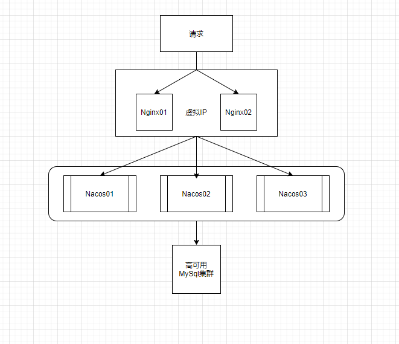
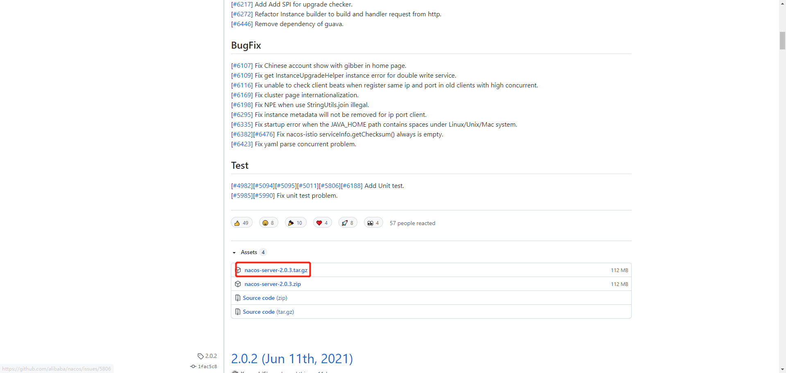
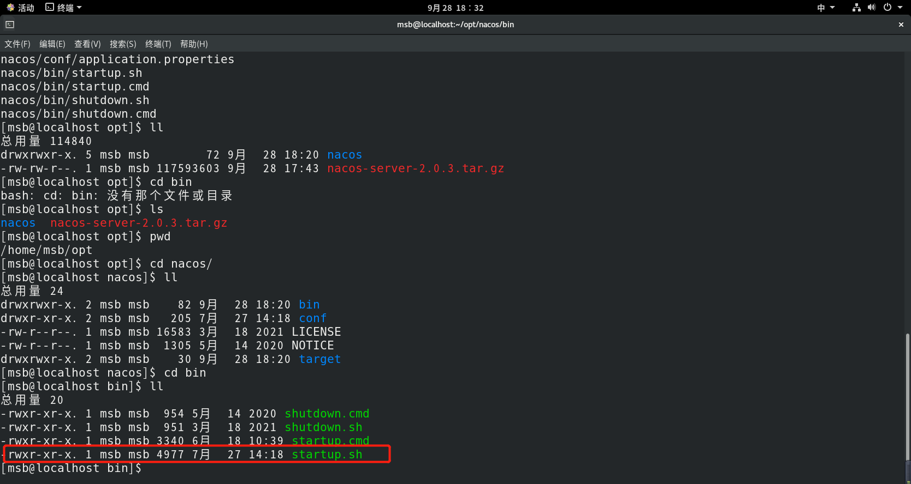

# Nacos之Linux版本安装


## Linux版Nacos+MySql生产环境配置

​	在之前的课程中我们已经给大家讲解过了Nacos生产环境下需要搭建集群配置，那么这里我们预计需要：1个Nginx+3个Nacos注册中心+1个MySql




## 具体配置：

1. 在官网上下载NacosLinux版本：https://github.com/alibaba/nacos/releases



2. 在Linux系统中解压此文件，并且把其中nacos目录拷贝到nacos目录中

```java
tar -zxvf nacos-server-2.0.3.tar.gz
```

3. 打开nacos目录下的bin目录输入命令即可执行



